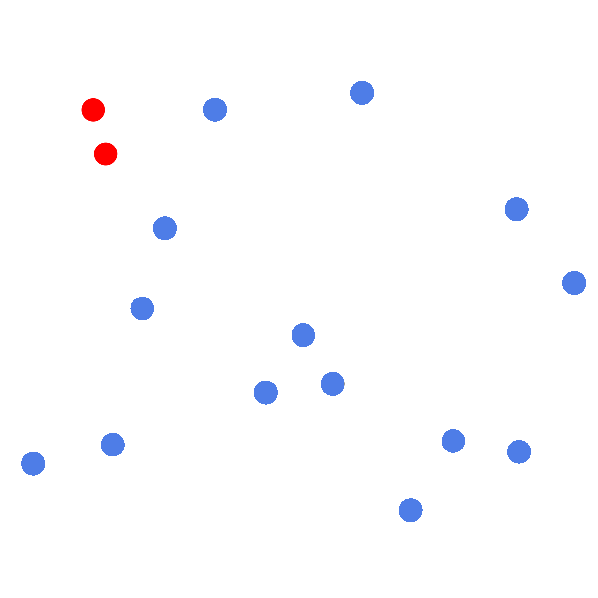

---

<pre>
 _____ _                     _    ______     _      
/  __ \ |                   | |   | ___ \   (_)     
| /  \/ | ___  ___  ___  ___| |_  | |_/ /_ _ _ _ __ 
| |   | |/ _ \/ __|/ _ \/ __| __| |  __/ _` | | '__|
| \__/\ | (_) \__ \  __/\__ \ |_  | | | (_| | | |   
 \____/_|\___/|___/\___||___/\__| \_|  \__,_|_|_|   
</pre>

Given a set of Points, the [**Closest Pair Problem**](https://en.wikipedia.org/wiki/Closest_pair_of_points_problem) asks for two Points, that are closest to another, i.e. minimal euclidean distance.

     
    <em>An example instance with solution.</em>

Disclaimer: Implemented algorithms work for 2-dimensional points, but could be expanded to work for n-dimensional points as well.

### Algorithms

3 algorithms were implemented in Rust:

| Algorithm        | Description   |
|------------------------------|---------------|
| brute_force                  | A simple $\mathcal{O}(n^2)$ algorithm that computes all pair distances and returns the smallest one.        |
| deterministic                | A deterministc $\mathcal{O}(n\;\log\; n)$ algorithm that uses a divide and conquer approach (for further details see [here](https://www.geeksforgeeks.org/closest-pair-of-points-using-divide-and-conquer-algorithm/)).        |
| randomized                   | A randomized algorithm that runs in $\mathcal{O}(n)$ in expectation [[Rabin 1976](https://en.wikipedia.org/wiki/Michael_O._Rabin)] . |

### Usage

    cargo run --bin closest_point <algorithm> <point1> <point2> <point3> ...

or

    cargo run --bin closest_point <algorithm> <pathToFile>

Where any point has to consist of two comma separated decimal numbers. 
Furthermore points in the file must be separated by new lines.

Due to the nature of the randomized algorithm, it will only work for non-negative points. This could be fixed by rearanging all points, then arrange them back after computation.
